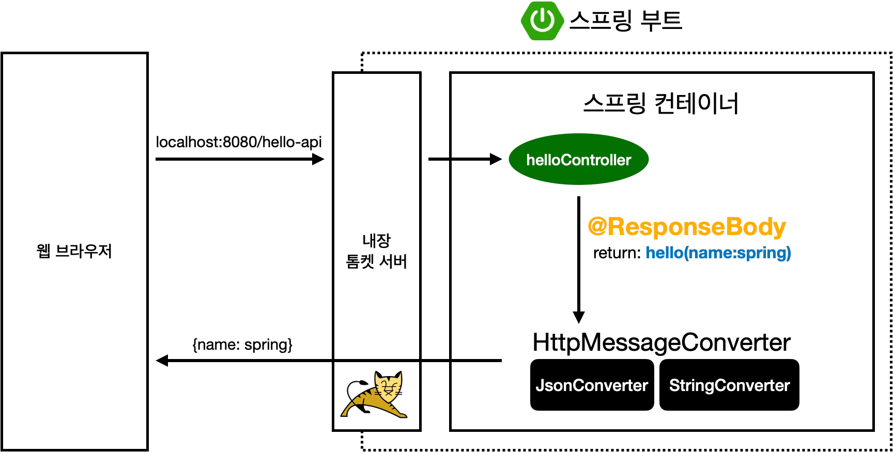

MVC: Model, View, Controller

### @Controller

- 스프링 MVC의 핵심 컴포넌트인 DispatcherServlet은 들어온 URL 요청을 어떤 메서드가 처리할지 찾는다.
- 이때 @Controller가 붙은 클래스의 안의 @GetMapping, @PostMapping 등을 찾아서 매핑 지도를 만든다.
- 만약 클래스 레벨에 @Controller 선언이 없으면  내부 메서드에 @GetMapping 등이 있어도 스프링은 이를 무시한다.
- 참고로 @Controller는 HTML 뷰 ( 타임리프, JSP) 를 반환할 때 주로 사용한다.
- @Controller가 붙은 클래스 내부 메서드에서 JSON을 응답하고 싶다면 @ResponseBody를 붙여야 한다.

### @RestController

- @RestController는 한마디로 모든 메서드에 @ResponseBody가 적용된 컨트롤러 라고 이해하면 된다.
- 메서드의 반환 값이 뷰 이름이 아니라 실제 데이터 ( JSON , XML )로 처리 된다.
- 자바 객체를 리턴하면 스프링이 알아서 JSON 형식으로 바꿔준다.

### @RequestParam
- 브라우저에서 요청한 파라미터를 매핑할 수 있다.
- URL에 있는 name이라는 키(key)의 값을 찾아서, 바로 뒤에 선언된 변수 name에 할당해 준다.
- 브라우저 주소창에서 입력한 값은 HTTP 프로토콜을 타고 서버로 전달될 때 전부 텍스트로 전달된다.
- 따라서 만약 RequestParam으로 받을 변수를 Integer로 해 두면 스프링이 내부적으로 캐스팅을 한다.
```java
    @GetMapping("hello-mvc")
    public String helloMvc(@RequestParam("name") String name, Model model) {
        model.addAttribute("name", name);
        return "hello-template";
    }
```


### @ResponseBody로 문자 반환
- 보통 컨트롤러에서 String을 리턴하면 스프링을 해당 이름을 가지는 html일 리턴한다.
- 하지만 @ResponseBody가 붙으면 ViewResolver를 거치지 않고 리턴 값을 HTTP응답의 body 부분에 직접 담아 보내게 된다.
- 결과적으로 사용자는 HTML소스 코드가 아닌 순수한 문자열을 받게 된다.
```java
@GetMapping("hello-string")
@ResponseBody
public String helloString(@RequestParam("name") String name) {
    return "hello " + name;
} 
```


### @ResponseBody로 객체 반환
- 위와 달리 @ResponseBody가 붙은 상태에서 객체를 반환하게 되면 스프링이 객체를 JSON으로 변환해서 반환한다.
- 이걸 API 방식으로 볼 수 있다.
```java
@GetMapping("hello-api")
@ResponseBody
public Hello helloApi(@RequestParam("name") String name) {
    Hello hello = new Hello();
    hello.setName(name);
    return hello;
}
static class Hello {
    private String name;
    public String getName() {
        return name;
    }
    public void setName(String name) {
        this.name = name;
    }
}
```


### @ResponseBody 사용 원리
- HTTP의 BODY에 문자 내용을 직접 반환
- `viewResolver` 대신에 `HttpMessageConverter` 가 동작
- 기본 문자처리: `StringHttpMessageConverter`
- 기본 객체처리: `MappingJackson2HttpMessageConverter`
- byte 처리 등등 기타 여러 HttpMessageConverter가 기본으로 등록되어 있음

