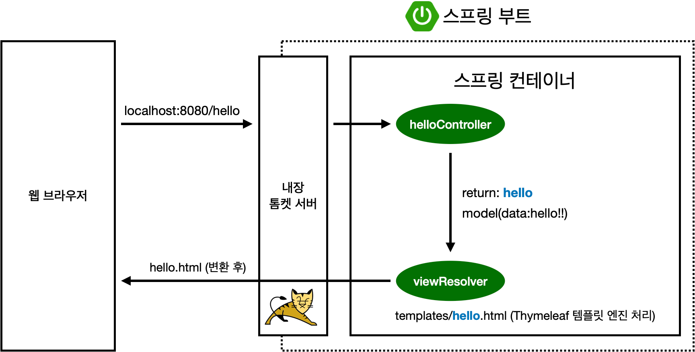

- 컨트롤러에서 리턴 값으로 문자를 반환하면 뷰 리졸버가 resources / templates 아래에서 화면을 찾아서 처리한다.

### 컨트롤러

Spring Boot가 실행될 때, `@Controller` 애너테이션이 붙은 클래스는 Spring IoC 컨테이너 안에서 특별한 웹 요청 처리 부품으로 등록되고 준비된다.

---

### 1. 시작: 스프링 컨테이너의 스캔 및 부품 찾기

* **상상:** 컨테이너를 관리하는 **기술자(Spring)** 가 공장 건물 내부를 돌아다니며 **"혹시 특별한 역할표를 가진 로봇이 있나요?"** 라고 외치며 클래스를 스캔한다.
* **코드 역할:** `SpringApplication.run()` 실행 시, Spring Boot가 설정된 기본 패키지를 뒤져 필요한 클래스를 찾기 시작한다.

### 2. 발견: `@Controller` 역할표 인식 및 빈(Bean) 등록

* **발견:** 기술자가 `HelloController` 클래스 위에 붙어 있는 **`@Controller`** 애너테이션을 발견한다.
* **상상:** **기술자가 이 로봇은 웹 요청을 처리하는 컨트롤러 로봇이군!"** 이라고 인식하고, 이 로봇을 **컨테이너 안의 주요 부품(Bean)** 으로 등록한다.
    * **핵심:** `@Controller`는 `@Component`의 한 종류이므로, Spring이 관리하는 대상(`Bean`)이 되어 `HelloController` 인스턴스가 생성된다.

### 3. 특수 인식: DispatcherServlet과의 연결

* **역할 지정:** 단순히 빈으로 등록되는 것을 넘어, `@Controller`는 이 클래스가 **"웹 MVC의 컨트롤러"** 역할을 수행함을 Spring에게 알려준다.
* **상상:** 기술자가 이 컨트롤러 로봇에게 **"너는 DispatcherServlet이라는 중앙 통제 장치와 직접 연결되어, 외부에서 들어오는 HTTP 요청을 받아 처리하는 임무를 맡아!"** 라고 지시한다.

### 4. 경로 매핑 정보 추출: `@GetMapping`

등록된 컨트롤러 빈 내부를 검사하여 웹 주소 정보를 추출한다.

```java
@Controller
public class HelloController {

    @GetMapping("/hello")
    public String hello (Model model) {
        model.addAttribute("data" , "hello!");
        return "hello";
    }
}
```

### 타임리프 html

```html

<!DOCTYPE HTML>
<html xmlns:th="http://www.thymeleaf.org">
<head>
    <title>Hello</title>
    <meta http-equiv="Content-Type" content="text/html; charset=UTF-8" />
</head>
<body>
<p th:text="'안녕하세요. ' + ${data}" >안녕하세요. 손님</p>
</body>
</html>
```