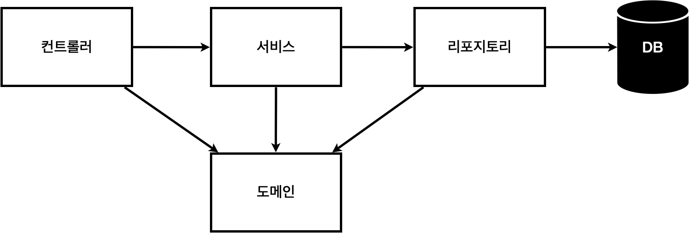
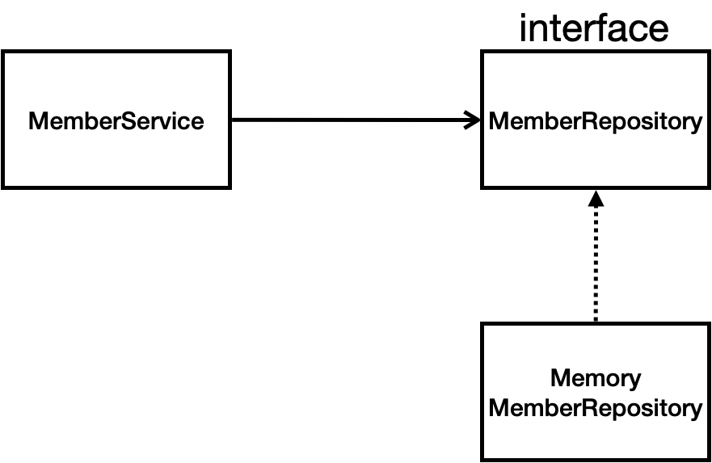

# 비즈니스 요구 사항 정리
- 데이터: 회원ID, 이름
- 기능: 회원 등록, 조회
- 아직 데이터 저장소가 선정되지 않음(가상의 시나리오)



- 컨트롤러 
  - 웹 MVC의 컨트롤러 역할
- 서비스
  - 핵심 비즈니스 로직 구현
- 리포지토리 
  - 데이터베이스에 접근, 도메인 객체를 DB에 저장하고 관리
- 도메인 
  - 비즈니스 도메인 객체, 예) 회원, 주문, 쿠폰 등등 주로 데이터베이스에 저장하고 관리됨

# 클래스 의존관계



- 아직 데이터 저장소가 선정되지 않아서, 우선 인터페이스로 구현 클래스를 변경할 수 있도록 설계
- <mark>쉽게 생각해서 뭔가를 바꿔 끼울려면 interface가 필요하다라고 생각하면 된다.</mark>
- 데이터 저장소는 RDB, NoSQL 등등 다양한 저장소를 고민중인 상황으로 가정
- 개발을 진행하기 위해서 초기 개발 단계에서는 구현체로 가벼운 메모리 기반의 데이터 저장소 사용

# 회원 도메인과 리포지토리 만들기

### 회원 객체
- 백엔드를 개발할 때 id 타입을 Long으로 설정하는 것은 업계의 관례다.
- Integer로 할 경우에도 사실 충분 하지만 만약 서비스가 커져서 21억개를 넘기는 경우도 많기 때문에
사실상 데이터가 넘칠 걱정이 거의 없는 Long타입을 쓴다.
- 여기서 long이 아닌 Long이라는 Wrapper Class를 사용하는 이유는 `null`처리가 가능하기 때문이다.
```java
package com.spring.intro.domain;


public class Member {
    private Long id;
    private String name;

    public Long getId() {
        return id;
    }

    public void setId(Long id) {
        this.id = id;
    }

    public String getName() {
        return name;
    }

    public void setName(String name) {
        this.name = name;
    }
}

```

### 회원 리포지토리 인터페이스

- `Optional<T>` 사용 이유
  - `Optional<T>`은 값이 존재할 수도 있고, 없을 수도 있는 상황을 명확하게 처리 하기 위해 사용한다.
  - NullPointerException(NPE) 방지
    - 과거에는 데이터가 없을 경우 null을 반환했다. 이 경우 이를 호출 하는 쪽에서 깜빡하고 null 체크를 하지 않으면
    프로그램이 멈추는 NullPointerException이 발생한다.
    - 이때 Optional을 반환하면 결과가 null일 수 도 있으니 조심하라는 메세지를 타입 시스템을 통해 
    강제로 전달한다.
  - 깔끔한 예외 처리와 기본값 제공 가능
    - Optional이 제공하는 다양한 메서드를 사용하면 if(member != null)같은 지저분한 코드를 줄이고 
  가독성을 높일 수 있다.
    
```java
// findById 결과가 없으면 에러를 발생시킴
Member member = memberRepository.findById(1L)
      .orElseThrow(() -> new IllegalStateException("존재하지 않는 회원입니다."));


// 결과가 없으면 새로운 객체나 특정 값을 반환
Member member = memberRepository.findByName("Spring").orElse(new Member());
```

- 인터페이스 구성
```java
package hello.hellospring.repository;
import hello.hellospring.domain.Member;
import java.util.List;
import java.util.Optional;

public interface MemberRepository {
    Member save(Member member);
    Optional<Member> findById(Long id);
    Optional<Member> findByName(String name);
    List<Member> findAll();
}
```

- 인터페이스 구현체

```java
package com.spring.intro.repository;

import com.spring.intro.domain.Member;

import java.util.*;

public class MemoryMemberRepository implements MemberRepository {
    private static Map<Long, Member> store = new HashMap<>();
    private static long sequence = 0L;

    @Override
    public Member save(Member member) {
        member.setId(++sequence);
        store.put(member.getId(), member);
        return member;
    }

    @Override
    public Optional<Member> findById(Long id) {
        return Optional.ofNullable(store.get(id));
    }

    @Override
    public List<Member> findAll() {
        return new ArrayList<>(store.values());
    }

    @Override
    public Optional<Member> findByName(String name) {
        return store.values().stream()
                .filter(member -> member.getName().equals(name))
                .findAny();
    }

    public void clearStore() {
        store.clear();
    }
}


```